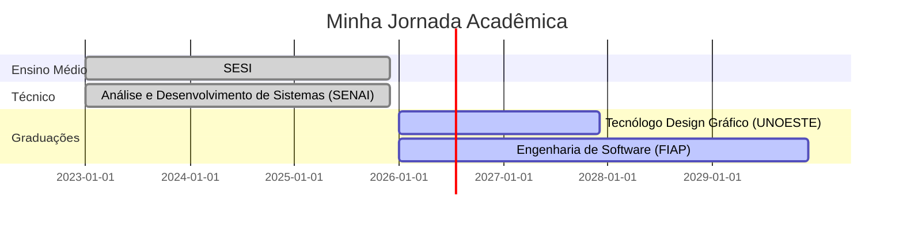

<div align="center">

# 💫 Olá, eu sou a Eduarda Scaliz

```ascii
   ╔═════════════════════════════════════════════════════════════════════════════════╗
   ║  🤖 Ex-competidora de Robótica  |  💻 Dev & Designer  |  🏆 2x Internacional  ║
   ╚═════════════════════════════════════════════════════════════════════════════════╝
```


<br>

[](https://www.linkedin.com/in/eduarda-scaliz-423034359)
[](mailto:dudascaliz@gmail.com)


</div>

## 🌟 Sobre Mim

> **17 anos • Presidente Prudente, SP • Apaixonada por desafios impossíveis**

Sou aquela pessoa que programa robôs para competições internacionais de manhã e cria campanhas de marketing à tarde. Meu superpoder? Transformar **lógica em arte** e **código em conquistas**.

<details>
<summary>📖 <b>Minha História em Números</b></summary>
<br>

```javascript
const eduarda = {
    localização: "Presidente Prudente, SP 🇧🇷",
    idade: 18,
    paixões: ["Robótica Competitiva", "Design & Tech", "Resolver o Impossível"],
    
    conquistas_internacionais: {
        first_lego_league: "🥈 2º Lugar Mundial - Robot Performance",
        robocup: "🥉 3º Lugar América Latina - Rescue Maze"
    },
    
    conquistas_nacionais: {
        obr_maker: "🥇 1º Lugar Nacional",
        microsoft: "🥈 2º Lugar - Campeonato MOS Word 2019",
        word_certification: "💯 Nota 1000/1000 (Perfeita)"
    },
    
    liderança: {
        gremio_estudantil: "Eleita com 53.78% dos votos",
        chapas_concorrentes: 7,
        equipe_liderada: 13
    },
    
    próximos_passos: [
        "🎨 Tecnólogo Design Gráfico - UNOESTE (2026-2027)",
        "💻 Engenharia de Software - FIAP (2026-2029)",
        "🤖 Análise e Desenvolvimento de Sistemas - SENAI (concluindo 2025)"
    ],
    
    atualmente: "Desenvolvendo sistema IoT para bibliotecas + Certificações Azure & AI"
};
```

</details>


## 🏆 Hall da Fama

<div align="center">

<table>
<tr>
<td align="center" width="33%">

### 🌍 INTERNACIONAL
**2º Lugar Mundial**  
FIRST LEGO League  
Robot Performance

**3º Lugar América Latina**  
RoboCup Rescue Maze  
Código matriz em 40 dias

</td>
<td align="center" width="33%">

### 🇧🇷 NACIONAL
**1º Lugar**  
OBR Maker Apresentação  

**2º Lugar**  
Microsoft Office  
Specialist Championship

**Nota 1000**  
Certificação Word 2019

</td>
<td align="center" width="33%">

### 🎖️ OLIMPÍADAS
🥇 **Ouro** - ONEE  
🥈 **Prata** - Canguru  
🥉 **Bronze** - OBA  
🏅 **Menção** - OBMEP  

</td>
</tr>
</table>

</div>


## 🛠️ Arsenal Tecnológico

<div align="center">

### 💻 Linguagens & Frameworks


### 🤖 Robótica & IoT


### 🎨 Design & Criação


### ☁️ Cloud & Ferramentas


</div>


## 📊 Estatísticas do GitHub

<div align="center">
  
  
</div>

<div align="center">
  
</div>

<div align="center">
  
</div>


## 🎯 Minha Trajetória

```python
class TrajetóriaEduarda:
    def __init__(self):
        self.foco_atual = [
            "🤖 Projetos IoT com sensores e cloud dashboards",
            "📚 Preparação certificações Microsoft Azure & AI",
            "🎨 Criação de campanhas visuais para vendas",
            "👥 Gestão de conteúdo para equipes e projetos sociais"
        ]
    
    def proximos_passos(self):
        return {
            "curto_prazo": "Concluir Ensino Médio e Técnico em Sistemas",
            "médio_prazo": "Dupla graduação: Design Gráfico + Eng. Software",
            "longo_prazo": "Trabalhar na interseção de tech e criatividade"
        }
    
    def filosofia(self):
        return "Inovação real acontece quando arquitetura lógica e experiência visual operam em sinergia ✨"
```


## 🚀 Projetos em Destaque

<div align="center">

### 🤖 Robótica & Algoritmos

<table>
<tr>
<td width="50%">

#### 🧭 Algoritmo de Navegação em Labirinto
**RoboCup Rescue Maze**
- 🥉 3º Lugar América Latina
- Código baseado em matriz
- Desenvolvido em 40 dias
- C++ + Otimização avançada

`#C++` `#Algoritmos` `#RoboCup`

</td>
<td width="50%">

#### 🏆 Robô FIRST LEGO League
**Campeão Internacional**
- 🥈 2º Lugar Mundial
- Design e estratégia
- Programação autônoma
- Recordes escolares

`#LEGO` `#FLL` `#RobotDesign`

</td>
</tr>
</table>

### 💼 Design & Marketing

<table>
<tr>
<td width="50%">

#### 📸 Campanhas de Marketing Digital
**E-commerce & Vendas Online**
- Fotografia + Design + Redação
- ROI comprovado

`#Marketing` `#Design` `#Fotografia`

</td>
<td width="50%">

#### 🎨 Identidade Visual para Projetos
**Gestão de Marca**
- Instagram estratégico
- Materiais gráficos
- Storytelling visual
- Engajamento comunidade

`#BrandDesign` `#SocialMedia` `#Storytelling`

</td>
</tr>
</table>

### 🛠️ IoT & Sistemas

<table>
<tr>
<td width="50%">

#### 📚 Sistema de Monitoramento Bibliotecário
**Projeto IoT - SENAI**
- Sensores de tráfego
- Integração cloud
- Dashboards de dados
- Em desenvolvimento

`#IoT` `#Cloud` `#DataViz`

</td>
<td width="50%">

#### ☁️ Certificações Cloud & AI
**Desenvolvimento Profissional**
- AWS Academy Graduate
- Azure (em andamento)
- Data & AI (estudando)
- Aplicação prática

`#AWS` `#Azure` `#AI`

</td>
</tr>
</table>

</div>


## 🌟 Liderança & Impacto Social

<div align="center">

<table>
<tr>
<td align="center" width="50%">

### 👥 Ex-Presidente do Grêmio Estudantil
**Chapa Polaris - SESI CE284**

🗳️ **53,78% dos votos** entre 7 chapas  
👥 **13 pessoas** na equipe  
🎉 **+10 eventos** organizados  
💬 **500+ estudantes** representados

*Negociação • Mediação • Organização*

</td>
<td align="center" width="50%">

### 🎭 Facilitadora - Juventudes AntiMisoginia
**Projeto SESI-SP**

👥 **36+ participantes** engajados  
🎪 **Projetos** criados  
💬 **15+ rodas** de conversa  
❤️ **Espaços seguros** de diálogo

*Empatia • Escuta Ativa • Mudança Cultural*

</td>
</tr>
</table>

</div>


### 🎯 Meus Valores

| **Excelência** | **Criatividade** | **Impacto** | **Aprendizado** |
|:--------------:|:----------------:|:-----------:|:---------------:|
| Busco sempre a melhor solução possível | Penso fora da caixa em cada desafio | Foco em resultados reais e mensuráveis | Nunca paro de evoluir |

</div>


## 🎓 Formação Acadêmica

<div align="center">



</div>

<table align="center">
<tr>
<td>

**🎨 Tecnólogo em Design Gráfico**  
*UNOESTE* • 2026-2027  
Foco em criação visual e UX/UI

</td>
<td>

**💻 Bacharelado em Engenharia de Software**  
*FIAP* • 2026-2029  
Desenvolvimento full-stack e arquitetura

</td>
</tr>
<tr>
<td>

**🤖 Técnico em Análise e Desenvolvimento**  
*SENAI* • 2024-2025  
IoT, Cloud Computing e Sistemas

</td>
<td>

**🏫 Ensino Médio - Bolsa Integral**  
*SESI* • 2023-2025  
1ª entre 90+ candidatos por mérito

</td>
</tr>
</table>


## 📫 Vamos Conectar?

<div align="center">

### 💬 Adoro conversar sobre:

`Robótica Competitiva` • `Programação de Algoritmos` • `Design Thinking` • `IoT & Cloud` • `Marketing Digital` • `Projetos de Impacto Social`

<br>

<table>
<tr>
<td align="center" width="35%">

#### 📧 Email
[dudascaliz@gmail.com](mailto:dudascaliz@gmail.com)

</td>
<td align="center" width="35%">

#### 💼 LinkedIn
[/eduarda-scaliz](https://www.linkedin.com/in/eduarda-scaliz-423034359)

</td>
</tr>
</table>

<br>

### 🌈 Localização

📍 Presidente Prudente, SP

<br>

</div>


<div align="center">

### ⭐ Se você chegou até aqui...

**Obrigada por conhecer minha jornada!** Se gostou do que viu, deixa uma ⭐ nos repositórios!

<br>


---

**💜 Feito com código, criatividade e muito ☕ por Eduarda Scaliz**

*"Transformando desafios impossíveis em conquistas internacionais, uma linha de código por vez."*

</div>
